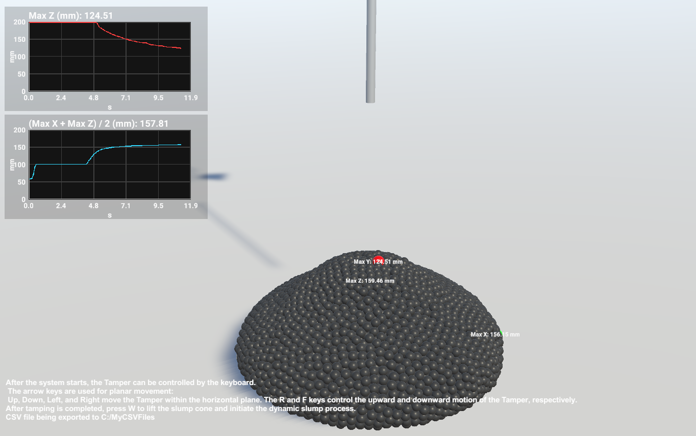

# Slump test in ShotcreteSimulation

This repository contains the custom Unity scripts and a runnable demo for the dynamic slump-test case described in the paper A Simulation Engine for Smart Shotcreting in Tunnel Excavation.
## Screenshot

## Contents

### Scripts
- `CollapseTracker.cs`  
  Tracks particle extrema and renders real-time charts for dynamic slump and dynamic slump radius.
- `LookAroundCamera.cs`  
  Controls the camera view.
- `MoveRightScript.cs`  
  Auxiliary movement/control script used in the demo scene.
- `PauseAfterW.cs`  
  Pauses the simulation automatically after a preset delay following the cone lifting.
- `SlumpconeMovement.cs`  
  Controls the lifting of the slump cone.
- `TamperMovement.cs`  
  Controls the movement of the tamper.

### Runnable demo
- `ShotcreteSimulation.zip`  
  Packaged Windows executable demo.

## How to run

1. Download `ShotcreteSimulation.zip`.
2. Extract all files to a local folder.
3. Run the `.exe` file inside the extracted folder.

## Keyboard controls

- **Arrow keys**: move the Tamper in the horizontal plane
- **R / F**: move the Tamper upward / downward
- **W**: lift the slump cone
- **Esc**: quit the program

## Output data

The simulation exports time-history data of the tracked quantities to a CSV file, including:
- dynamic slump
- dynamic slump radius
- related extrema values used in the real-time display

## Notes

Third-party plugins and assets, including Obi Fluid, are not included in this repository and must be obtained separately through legitimate purchase and licensing before use. All contents provided in this repository are intended for research purposes only and are not for commercial use.

## Screenshot

A representative screenshot of the demo can be added here.
